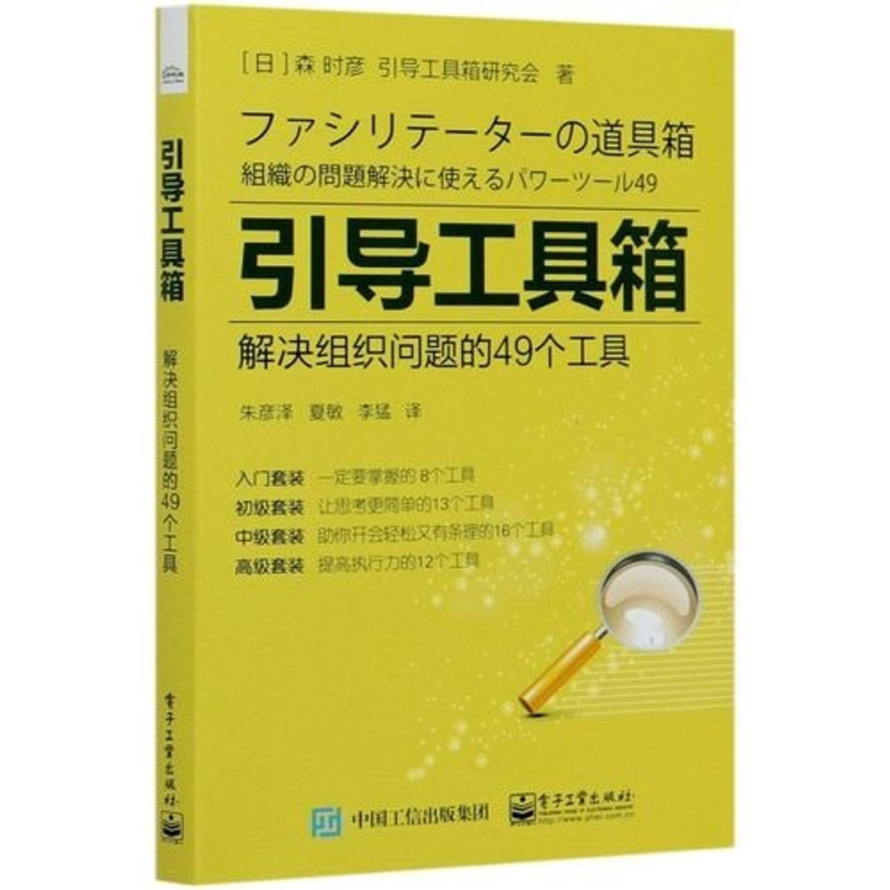

# 《引导工具箱》——如何运用工具进行有效引导
## 我是如何得知这本书的？
我平时经常参加敏捷社区的活动。在一次关于Scrum团队仪式和引导的分享中，嘉宾强调了引导对于团队，特别是敏捷团队的重要性 ，并在最后推荐了这本书。
由于我的工作内容中很重要的一部分就是引导团队和他人，寻找问题，探索解决方案，达成共识，并帮助他人培养良好的引导能力，所以这本书立即上了我的书单。

## 为什么我会推荐这本书？
### 什么是引导？
"引导技术是通过引导讨论过程，创造以下情况: 1）活跃人与人之间的关系以及团队的思维，促进发展；2）推动建设性讨论、活跃团队、提高实践能力；3）消除怒吼、骂声、牢骚和不满，形成充满新创意与笑声的团队。"

### 我们为什么需要引导？
想象一下，常见的会议或活动是否出现过以下情况：拖拖拉拉，严重超时；参与者在底下玩手机；讨论无结论；只有少数人发言，缺乏活跃参与；跑题；气氛凝重；上面开大会，下面开小会；走神或打瞌睡；一言堂……如果你的会议或活动出现过以上任何一种现象，那么引导技术可能会为我们带来巨大价值。
更重要的是，引导能够"提高团队的知识生产性和创造性"，这两个因素对于知识生产型团队的能力至关重要。

### 这本《引导工具箱》能为我们带来什么？
《引导工具箱》正如其标题所述，是一个包含49个引导工具的工具箱。工具按照难易程度被划分为入门套装、初级套装、中级套装和高级套装。当我们需要寻找适合不同环节的工具时，可以通过发散性工具、总结型工具以及发散和总结的通用工具来寻找。
此外，从促进团队思考的角度来看，工具被分为思考整体情况、从分析角度思考以及从其他角度思考这三类。这有助于我们根据不同的主题选择合适的工具。
除了工具本身，这本书还从引导的角度出发，介绍了一些基本概念，并为希望提升引导技能，甚至想成为专业引导顾问的读者提供了一些宝贵的建议。

## 我认为什么样的人更需要读一下这本书？
如果你经常需要组织会议或活动，例如Scrum Master或Team Lead，这本书可以提供许多现成的工具，以提升你的组织和引导技能。你可以直接选择其中的一些工具，帮助你和你的团队通过集体思考获得更多收益。
如果你是会议的参与者，这本书可以帮助你更好地理解引导和集体参与的重要性。你可以在适当的情况下向会议组织者建议使用某些工具，以提高会议质量并帮助团队更好地协作。
如果你讨厌开会，喜欢独自工作，这本书可以为你提供新的视角，探索集体智慧可能带来的差异。

## 如何使用这本书？
引导工具远不止这本书所介绍的。对于我们这样的非专业引导者，掌握一两种工具，针对不同情况已经足够。例如，我们需要一两种用于破冰的小游戏，一些用于发散思维的工具，以及一些用于帮助大家收敛总结的工具。同时，了解一两个整体性活动，如世界咖啡，可以在需要时针对特定话题进行深入探讨。工具本质上是为人服务的，理解引导的意义，并选择合适的工具以达到引导的目的即可。

## 《引导工具箱》中的工具简介——总有一款适合你
### 入门套装——一定要掌握的8个工具
- 破冰I——和初次见面的人愉快聊天！（一些简单的破冰游戏可以帮助大家了解彼此，从而营造出良好的会议氛围）
- 破冰（打破隔阂的游戏）——用脸猜拳决胜负！（一些有趣的游戏可以改善会议的氛围）
- 基本规则——一开始就定好规则，更容易展开讨论！（共同制定基本规则能有效地帮助大家开展高效的会议）
- 停车场（PA）——这样讨论就不会跑题！（Daily Scrum的常用技巧可以帮助我们记录下吸引会议注意力的因素，并确保会议不会偏离主题）
- 头脑风暴——头脑风暴要这样进行才会顺利！（头脑风暴是一种常用的技术，但根据使用方法的不同，会产生不同的效果）
- 亲和图——分组促进新想法的产生！（当我们希望通过思考来产生新的想法时，亲和图是一个很好的选择）
- 目标树——共享目标，提高团队合作能力！（促进目标共享，并进行目标的细化）
- 4W1H——确认行动项目并养成习惯！（5W1H去掉why）
### 初级套装——让思考更简单的13个工具
- 破冰II——你也需要做些伸展运动！（这些破冰工具可以帮助我们在会议中营造活跃的气氛，让大家放松心情）
- 传球发言——一个球就能让交流很顺利！（在各种会议中都可以采用这个工具来提高参与度。你可以使用一些现有的工具，或者采用一些更有趣的方式，比如抛接球来提升注意力）
- 可控与不可控——集中精力于能做到的事！（这可以帮助我们将注意力集中在我们可以影响和改变的事情上。在回顾会议结束前，当我们讨论行动项目时，这可以帮助我们更专注于我们真正会采取行动的项目。）
- 更多与更少——轻松共享理想状态！（这是回顾会可以采取的一种形式）
- As is To be——共享理想状态！（帮助我们区分现状与理想状态，以便让大家对理想状态有更好的共同理解）
- 毁誉分析——将赞成和反对的理由全写出来！（这能帮助我们全面分析问题，同时也让那些有反对意见，但不愿或不敢表达的参与者能更好地表达自己的想法）
- 流程图——打破瓶颈！（通过可视化和协作的方式确认对流程的理解，并发现其中的瓶颈和问题）
- 收益矩阵——利用双轴筛选想法！（这是一种多维度分析，我们可以通过价值和可行性这两个维度快速帮助我们选择真正需要专注的项目）
- 圆形分析——用圆形分析清楚区分！（用于快速区分包括与不包括，范围内与范围外等）
- 报纸测试——解决虚假问题！（用虚拟的方式来测试某事对我们的影响）
- 曼陀罗思考法——通过多角度思考促进思维展开！（这个工具可以帮助我们在不偏离主题的情况下引发富有创意的讨论）
- 帕累托分析法——别再做无用功了！（著名的二八法则）
- 回顾时间——培养善于从日常经历中学习经验的团队！（培养回顾能力是形成一个懂得学习的团队的第一步） 
### 中级套装——助你开会轻松又有条理的16个工具
- 团队建设——提高团队集体感！（团建有很多游戏选择，这里列出了一些短小的游戏供我们参考，可以直接在会议场景中使用）
- 三言两语带进及带离——提高开会时的注意力！（这个工具可以帮助大家快速进入会议状态，并且在会议结束时确认参与者的当事人意识） 
- W/C表格——引导员工承担义务！（通过让团队成员列出他们的期望wants和承诺commitment来促进他们积极承担责任）
- 世界咖啡屋——人多也能互相讨论、互相深入！（这是一种非常有趣的活动，可以适用于不同的人数并促进大家深入交流。后面我会介绍我们公司内部举办过的世界咖啡活动）
- 二分重构法——要转换视角！
- 逻辑树——巨细无遗地解决问题！（这个工具可以帮助我们通过逻辑层次来分析问题。）
- 鱼骨图（石川图表）——利用鱼骨图系统地解决问题！（鱼骨图是一种常用的问题分析可视化工具，Xmind和Teams都提供了相应的模板，帮助我们快速创建鱼骨图）
- 思维导图——大家一起发散思维！
- 检查已做到的事——自然而然地采取下一步行动！（这个工具可以帮助大家从较为消极的心态，即过度关注未完成的事情，转变为较为积极的心态，即关注已经完成的事情。并以此为基础寻找下一步可以做的事情。从一个成功出发，走向下一个成功，相对来说会更容易。）
- 容器——想改变规模时不妨用用看！
- 领导融合会——缩小领导与下属间的距离！（虽然我们进行了一些跨层级交流，但实际上并未达到预期的效果，这个工具为我们提供了一些有助于进行跨层级交流的小技巧）
- 乔哈利咨询窗训练——透过他人眼中的自己了解自我，完成飞跃！（这个工具可以帮助我们通过他人的反馈，找到自己可以改进的地方）
- 成员的使用说明书——改变氛围！（一种很有趣的促进团队成员交流和改善沟通的工具）
- 机会图——共享战略视野！
- PREP法——有条理地去听！去说！（这种交流框架能帮助我们更有条理地理解他人的观点，也能更好地表达自己的想法。）
- n/5投票法——迅速筛选后再进行下一步讨论！（当想法太多时，我们需要一种快速的筛选方法，如投票，来确定大家需要关注的领域）
### 高级套装——提高执行力的12个工具
- 力场分析——思考动力，掌握执行力！（大多数事情，特别是一些变革，总会遇到一些阻力，也会有一些有利的促进因素。立场分析可以帮助我们找到这些阻力和动力，并进一步探索如何增强动力，减少阻力。）
- 利益相关者分析——找出关键人物，实现计划！（这个工具能够帮助我们更全面地分析利益相关者，以获得更多的支持并减少阻力。）
- 决策树——不要说“决定不了”！（这是一种量化风险或收益的工具，它通过估算的方式帮助我们做出决策）
- 期望与课题的矩阵图——突破课题繁多的头脑风暴！
- 思维系统图——拜托恶性循环！（许多事物，例如思维模式和工作模式，在没有可视化的情况下可能很难发现问题。这个工具可以帮助我们发现思维模式中的问题，如兜圈子、消极思维、缺乏对成长的思考等。）
- 要素图——解决项目延迟问题！（这个工具可以以可视化和量化的方式帮助我们分析瓶颈的存在）
- 风险评估表——选择最小风险克服危机！（一种简单的风险量化工具）
- 双收益矩阵——找出先后顺序的共同点！（这是一个可以帮助我们在分歧中寻找共同利益的多维度分析工具）
- 时光机法——享受构筑愿景的过程！（通过设想未来来构建共享的愿景）
- 采访英雄——让对方会想起过去的辉煌，重新振作起来！（这种工具可以帮助团队成员重建信心，发掘并发挥自己的潜力）
- SWOT法——用SWOT提高战略意识！（优势，劣势，机会，威胁是我们常用的讨论和分析框架）
- PPM——用痛苦和喜悦的原则打破现状！（这种工具可以帮助人们从新的角度来思考变革）
## 在工作中的实际案例
### 假的自我介绍
最近，我组织了一次为Analyst举办的Coaching Circle。在第一次的启动会议中，为了让参与者能快速进入状态并对其他人有基本了解，我们进行了破冰活动。
在会议开始前，我通过邮件分享了议程，并提醒每个人准备三个关于自己的趣事，其中两个是真的，一个是假的。我也给出了一些简单的示例。我们可以根据会议主题或我们希望参与者了解的具体方面来给出相关的示例。
在正式开始会议后，我解释了我们为什么要进行破冰活动。然后，我以自己为例，分享了三个趣事。然后，每个人轮流猜哪个是假的。公布答案后，我们可以补充一些相关的事情。每个人大约需要一到两分钟，对于10人以下的会议，这种破冰方式需要大约10分钟。破冰活动结束后，进入正式议题，大家的参与度会有所提高。在会议开始时发言的参与者，会议过程中再次发言的可能性会大大提高。
传球发言和三言两语带进及带出
在一个团队的Coaching启动会上，我们采用了类似"击鼓传花"的方式。我们播放轻松的音乐，让大家传递一个球。当音乐停止时，持球者需要分享对于启动会的期待，作为会议的开场。
这种方式产生了以下效果：1）所有团队成员的参与感都提高了，他们对会议的期待得到了更显性的表达；2）根据大家的期待，组织者可以对会议内容进行适当的调整；3）会议的氛围变得更轻松和活跃。

### 世界咖啡屋
在23年底的EE嘉年华上，我以DORA和DevOps为主题组织了一次世界咖啡屋活动。通过公开报名和邀请，很多DevOps专家参加了这两个小时的"咖啡屋"活动，在此期间，我们围绕DORA和DevOps进行了四个相关话题的深入讨论。作为主办方，我们也提供了每人一杯的咖啡。

世界咖啡屋活动需要有一个中心话题，也就是活动主题。现场会有多张"咖啡桌"，参与者围绕自己感兴趣的具体话题进行分享和讨论。每桌的具体话题由参与者在活动开始时提出，提出话题的人自动成为该"咖啡桌"的桌长。
为了提高讨论效率和促进交流，活动会分为三个时间盒（每盒15分钟）。每个时间盒结束后，除桌长外的参与者会轮换到下一桌，参与另一话题的讨论。这样的轮换方式使得想法和信息能在房间内传递，同时通过参与者的流动，避免了讨论被某些强势发言者主导的问题。这两个小时的讨论只是开始，很多参与者都收获了具体或初步的想法，也认识了其他团队的专家。这些都可以成为解决问题，产生更多价值的起点。