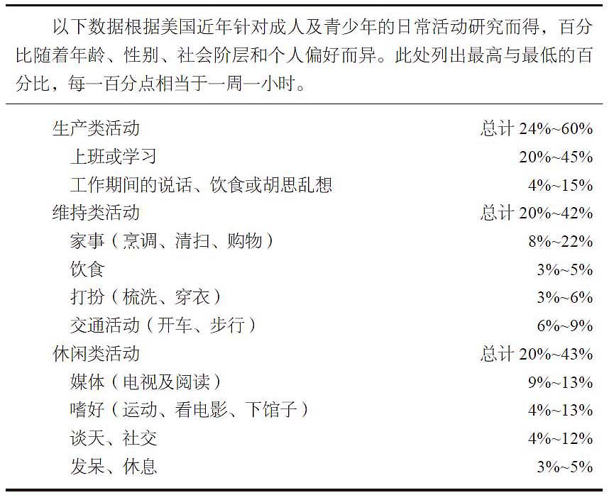
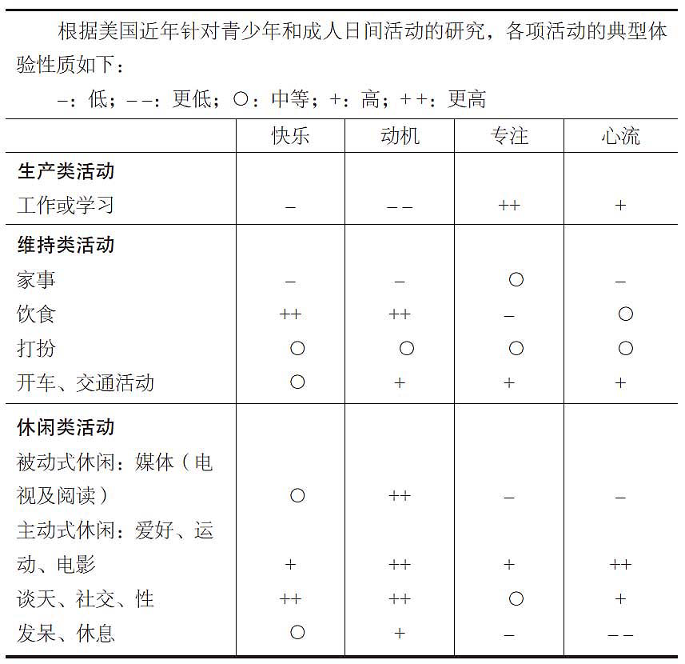
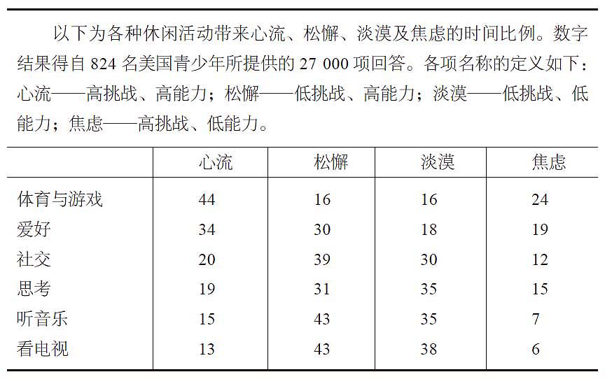

# 心流发现：日常生活中的最优体验

在忙碌而纷扰的现代生活中，我们常常渴望找到那种完全投入、忘却时间流逝的美妙状态。《心流发现：日常生活中的最优体验》这本书，就是探索这种被称为“心流”的神秘现象，以及如何在我们的日常生活中实现它。

心流是一种深度沉浸的状态，它让我们在从事某项活动时，完全忘却自我，达到一种忘我的境界。作者通过对心流的深入研究，揭示了这种体验的构成要素：挑战与技能的平衡、明确的目标、即时反馈、深度专注和控制感。这些要素共同作用，让我们在心流中体验到时间的飞逝和成就感。

## 怎样获得心流

### 日常活动中的不同感受

#### 时间去哪了？ 

从我们的角度简单来看，可以分三块，睡眠8小时，工作8小时，维持+休闲8小时。

#### 心流研究

表2.1 显示了日常活动中人们情绪、动机、专注力和心流体验的情况。
工作和学习时，人们虽然快乐程度不高，但注意力集中，心智投入程度最高，且常出现心流体验，主要原因因为挑战与能力匹配，目标明确，反馈迅速。
维持类活动，通常得分不高，因为很少有人喜欢做家务。进食时情绪和动机最佳，但认知运作低，心流体验少。开车虽然快乐和动机中等，但由于需要技巧和专注，心流体验较多。
休闲活动，尤其是主动式休闲，如爱好、运动等，最正面，动机强，快乐、专注和心流体验达到高峰，但主动式休闲时间相对较少，许多人因过多被动式休闲而牺牲了主动式休闲。

### 心理体验抽样法

作为个体，每个人都独一无二，要想获得心流体验，首先需要了解你自己。
心理学家的研究方法也可以当作我们认识自己的工具。

“心理体验抽样法”（Experience Sampling Method，简称ESM），这是作者在20世纪70年代早期在芝加哥大学创立的研究方法。它采用呼叫器或具有设定功能的手表，提醒受试者按时填写随身手册中的两页问卷。呼叫信号设定为每两小时响一次，由每日清晨起算，至晚间11点或更晚。呼叫器响时，受试者要写下所在位置、所做何事、所想念头、有谁为伴，再以数字描述当时的意识状态，例如快乐程度、专心程度、动机高低、自尊心强弱等。

契克森米哈赖建议读者用一周或两周时间，记录自己的日常感受。例如自己什么时候心情最好，什么时候最差？观影时是否像想象中那样兴奋？跑步时是否像预期的那么疲累？一定要记录自己的真情实感，而不是“应该”产生的感觉。对比不同时段的心理感受，我们就可以科学地反思自身，为何心流体验出现在特定的活动和情境中。

### 体验心流的重要因素

1. **明确的目标**：心流体验往往发生在个体从事具有明确目标的活动时。这些目标提供了行动的方向和准则，使参与者知道应该做什么以及如何做。明确的目标有助于集中注意力，减少分心，从而更容易进入心流状态。

2. **即时反馈**：在心流活动中，个体能够及时得到结果反馈，这种反馈让人知道自己的表现如何，是否需要改进。即时反馈强化了行为，增加了相同行为再次发生的概率，有助于维持心流状态。

3. **技能与挑战的平衡**：心流产生的最重要前提条件是个人技能与活动挑战之间的平衡。当技能与挑战不平衡时，心流不会实现。只有当二者达到平衡时，心流才会出现。挑战应该略高于技能，以促进个人成长同时保持参与感和成就感。

4. **全神贯注**：心流状态要求个体完全沉浸在活动中，排除外界干扰。这种深度专注使得个体能够心无旁骛地投入到任务中，从而更容易达到心流状态。

5. **掌控感**：在心流体验中，个体感到能够控制自己的行动和结果。这种控制感来自于技能与挑战的匹配，以及活动中的即时反馈，它增强了个体的自信和参与度。

通过这些策略，我们可以在日常活动中更容易地找到并维持心流状态，从而提升效率、创造力和生活满意度。

## 热爱命运

这种态度充分表现在尼采哲学的中心思想——“热爱命运”上。他在讨论人如何才能活到极致时，如此写道：

我给伟大开的药方是“热爱命运”，也就是不求相异，不求前进，不求后退，不求永垂不朽……不光是忍受无可避免之事……而是要爱它……我想要逐渐学会领悟事情必要性之美，如此我方能成为制造美丽事物的人。

马斯洛从研究中也得出了类似的结论。他在观察及访问一些被他认定为自我实现之人（包括创造力十足的艺术家及科学家）后，得出一个结论：充实的巅峰体验来自成长的过程，其中又牵涉自我与环境的配合。他将这种现象称为“内在需求”与“外在需求”一致，或“我想要”及“我必须”之间的协调。唯有如此，“你才能自由自在、快快乐乐、全心全意地拥抱自己的志向。你的命运就是自己的选择及意愿”。

心理学家卡尔·罗杰斯也有类似的看法，他认为，功能健全的人格是：
这种人的行为是出于自己的决心或选择。他试图在内外的激励中，寻求一种最简洁有力的行动途径，因为这一行为最令人满意……功能健全的人不光能体验到自发、自在、自愿选择，以及矢志不渝的绝对自由，并且还能加以运用。

由此可知，不论是出于自发还是外在的压力，热爱命运相当于接受自己的行动主宰权。由于这份认知，个人才有办法成长，并获得祥和愉悦之感，扫除日常生活紊乱所带来的心理负担。

## 结语

我们的快乐来自他人的承认，来自外界的回报，但终究来自内心的愉悦。最后，我以书中的精彩段落作为结语，祝你也成为这样的人：
“具有自得其乐性格的人，不太需要物质财富、娱乐、舒适、权力或名望，因为他所做的事情本身就已经是一种回馈。由于这种人不论在工作、家庭生活、人际互动、饮食甚至是独处时，都能感受到心流，因此不太会依赖外在的报酬行事，过着沉闷枯燥、了无意义的公式化生活。他们不受外来事物的威逼利诱，显得较自动自发、独立自主，因为全心投入生活，他们对身旁诸事也多多参与。”

整理 by Thyme